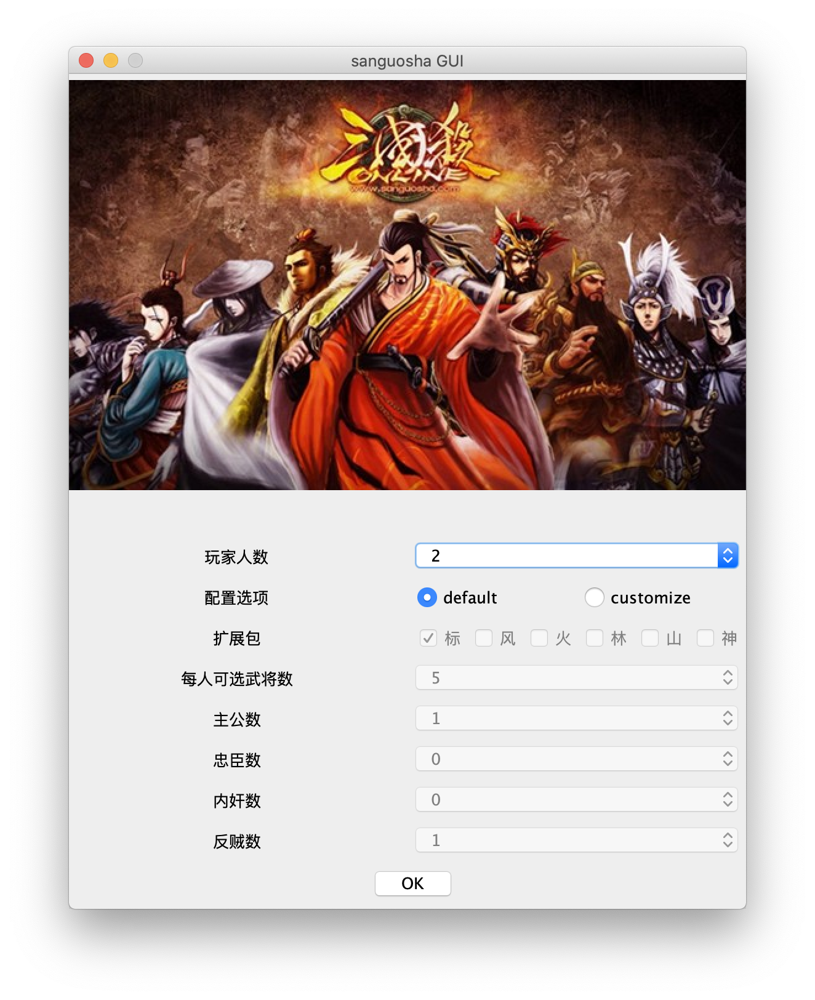
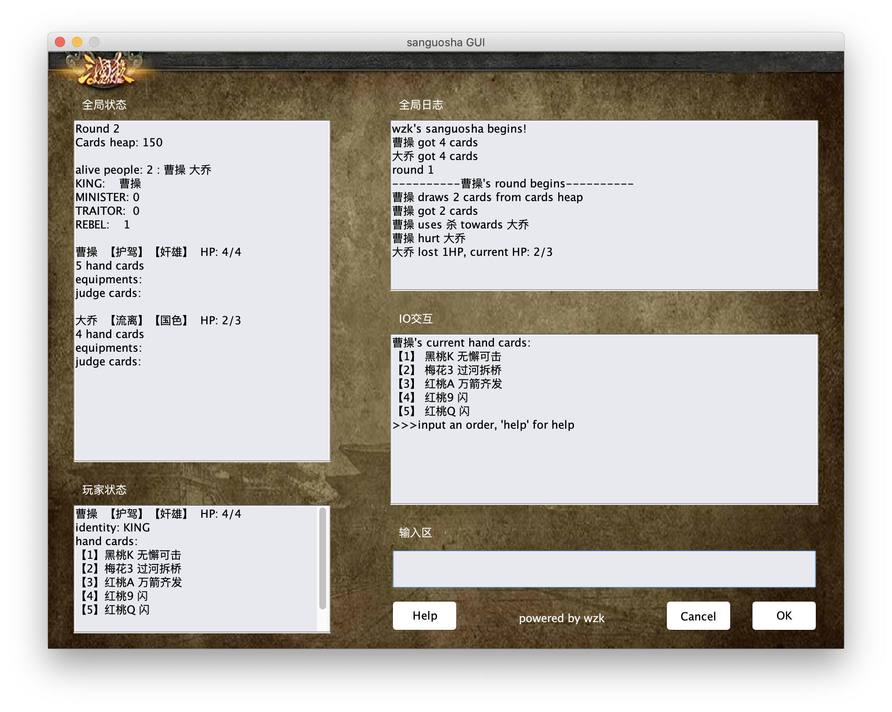
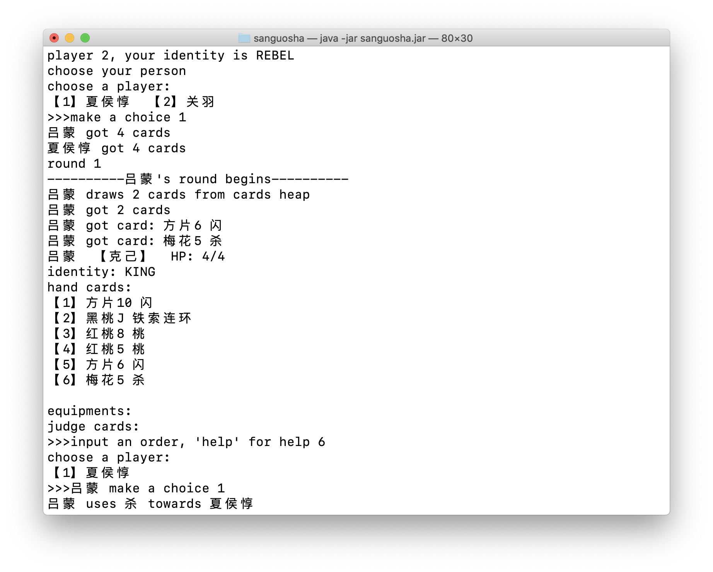
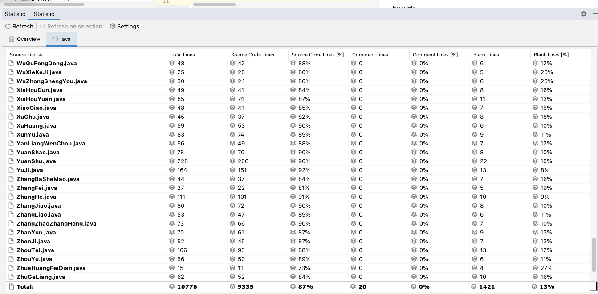
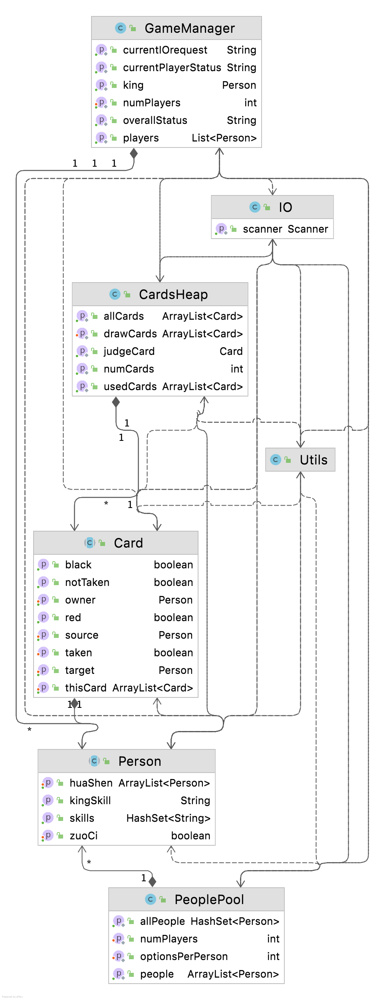

# 文字三国杀

**开发完毕**

文字版三国杀，java实现，**10000+行**

GUI+命令行两种运行模式

身份局，支持标准包+风火林山神将，模式为单机多人

**符合checkstyle规则**

纯属娱乐项目

by wzk

## 试玩！

### 前提条件

系统内安装jdk（版本1.8以上）

### GUI运行

`git clone`或直接下载仓库，使用命令行（windows下可按下win+R输入cmd，mac下打开终端）进入下载目录，运行`java -jar sgsgui.jar`即可畅玩！

### 命令行运行

同上，运行`java -jar sanguosha.jar`，即可命令行运行

### 自定义！

默认配置下使用全套卡牌+武将标准包，身份根据人数预先设定。在初始化时选择`customize`，即可自定义扩展包、身份分配、每个玩家可选的武将数量。

## 更新日志

* 6.5  初次commit
* 6.5  增加三尖两刃刀；修改了`IO.chooseFromProvided`；
* 6.5  增加丈八蛇矛、贯石斧；增加了`useSkillInUsePhase`接口（用于出牌阶段主动发动技能）
* 6.6  增加借刀、南蛮万剑、桃园五谷等锦囊牌；修改了`Person.hurt`；
* 6.6  牌堆`CardsHeap.init`中完成基本牌初始化
* 6.7  完成了`CardsHeap.init`中所有牌的初始化，可以玩🌶；修改了过拆、顺牵
* 6.7  通过测试修复了若干bug，增加若干IO输出；**3000行撒花！💐**
* 6.9  增加了注解技能类`Skill`及觉醒技、锁定技等（现学现用）；开始添加武将：郭嘉荀彧；
* 6.9  增加了国籍和身份（实际上是因为主公技而不得不加），可以打身份局🌶；增加了刘关张、曹操等武将
* 6.9  `README`中增加了更新日志；
* 6.10  增加了马超黄忠赵云（五虎将集齐）、诸葛亮黄月英（标包蜀国完成）；增加了牌数检查；修复了小bug
* 6.10  增加了司马懿夏侯惇；修复了死亡时未弃置所有牌的bug；更正了黄月英的性别；**4000行打卡✌️**
* 6.11  增加了许褚张辽甄姬（标包魏国完成）；对`losecard`和`throwcard`做小改动；修复了判定牌未进入弃牌堆的问题
* 6.11  武将类实现的`PlayerIO`接口，重构IO调用；增加孙权；增加限定技注解类
* 6.11  增加武器使用前询问；修改hurt参数（方便奸雄多张牌）；修改闪电；修正弃置装备牌数不匹配的问题；修正裸衣驱虎制衡
* 6.12  增加吕蒙黄盖甘宁；`Person`类属性全部移至`Attributes`类
* 6.12  增加周瑜大乔孙尚香陆逊吕布貂蝉华佗袁术（标包完成！！！）；修改`judgeCard`增加`thisCard`属性；
* 6.14  增加通过注解值打印技能列表的功能（学会反射√）；增加风包曹仁魏延夏侯渊周泰；**5000行打卡✌️**
* 6.14  增加小乔张角于吉、神吕蒙神关羽，风包完成！
* 6.15  完成火包（除神将）：典韦卧龙庞统袁绍庞德颜良文丑太史慈；**6000行鼓掌👏**
* 6.16  增加火包神将神周瑜、神诸葛亮
* 6.17  完成林包、神曹操神吕布；`Person`类与行动无关的方法全部移动至`Attributes`；`GameManager`与游戏运行无关的方法全部移动至具体卡牌或`PlayerIO`；修正无双；**7000行！**
* 6.18  增加姜维刘禅邓艾左慈；提取拆顺行为移动至`PlayerIO`；增加醒后技注解类
* 6.18  移动`GameManager`的`askTarget`至`Card`；`PeoplePool`中增加风火林山包武将；修改README
* 6.18  完成山包；**8000行！**
* 6.19  增加神司马神赵云；**神话再临完成！**
* 6.19  修复了神将的若干bug；武将和卡牌增加了`help`接口
* 6.19  全部代码移动至`sanguosha`包下；修复了`chooseManyFromProvided`
* 6.20  将大部分武器的逻辑移动至武器内部；修复了借刀、强袭、帷幕等若干bug
* 6.26  增加发行版jar包；增加对ctrl+d中断的响应；修改`showHelp`
* 6.28  **增加GUI**！swing现学现用~
* 6.28  修改IO输出方式（公开、私有）；修复若干bug
* 6.29  增加游戏人数、武将包自定义；完善了全局状态信息；endWithError修改为panic
* 7.1    10000行！！！重构IO；实现化身伪帝；完善help；修改GUI
* 7.2    **基本完成！**增加GUI启动页面，完善help，将左慈技能改为接口
* 7.2    修复了图片路径问题；修改README

## 功能介绍

本软件基于Java实现了文字版三国杀，其中包括了66个武将，41种手牌及若干其他功能类，共计147个类和接口，采用高度面向对象的设计方法实现，总行数达到**10000行**以上。同时，使用了swing开发了GUI作为游戏界面。代码经过仔细整理和重构，使用checkstyle检查，符合google的代码设计规范。

主要实现了三国杀对战的功能，涵盖了上百种不同技能，可以进行单机多人对战、玩家挑战AI等，支持自定义游戏人数、身份配置、武将扩展包等功能。玩家通过键盘输入命令与程序交互，在屏幕上以文字形式展示游戏进行流程、全局每名玩家的状态、当前回合玩家的状态等信息。游戏中每名玩家依次执行自己的回合，打出卡牌或使用技能触发一系列复杂的判定过程，并实时判定游戏结束条件，在触发游戏结束条件时结束程序，输出获胜者。

## 整体架构

整体架构上，由GraphicLauncher调用GraphicRunner类的run方法启动游戏。该方法初始化游戏界面和ActionListener，随后初始化游戏内核GameLauncher，并通过JTextField组件的输入内容与游戏核心进行交互。

游戏内核GameLauncher调用游戏管理核心GameManager，完成初始化牌堆、分配身份、选择武将等步骤，并循环执行每个玩家的回合，直到触发游戏终止条件时，输出获胜者。

每名玩家的回合在其武将类Person的run方法中执行，依次进行回合开始阶段、判定阶段、摸牌阶段、出牌阶段、弃牌阶段、回合结束阶段。在此过程中会有多个触发技能的时机，此时会进入到武将子类的技能方法中（重写父类方法）执行。使用手牌（基本牌、锦囊牌、判定牌）时，会进入到该牌的判定过程中，将使用者与该牌的对象进行交互。

## 设计实现

### 管理类

#### GameManager

* 负责游戏宏观运行（每名玩家依次出牌、判定胜负条件、角色死亡等）
* 提供涉及到多个玩家的调用接口
  * 铁索连环伤害
  * 拼点
  * 查询玩家之间的距离

如果将整个游戏理解为操作系统，那么GameManager相当于内核，提供系统调用帮助卡牌和武将完成功能。

#### IO

* 封装系统IO接口，例如输出卡牌信息、获得输入内容

#### Utils

* 提供常用工具包，例如断言、深拷贝、随机整数等

### 牌堆类

#### CardsHeap

* 游戏开始时初始化牌堆，分配手牌
* 负责牌堆和弃牌的管理，提供摸牌、弃牌与判定接口
* 牌堆为空时自动洗牌
* 为诸葛亮、神吕蒙等提供查看牌堆与操控牌堆的接口

#### PeoplePool

* 游戏开始时初始化武将牌，分配武将
* 游戏开始时为玩家分配身份
* 为左慈提供分配化身接口

### 人员类

#### SkillLauncher

接口，设定了一些技能发动时机的方法，默认均为空函数体，Person类实现该接口。若武将需要设置技能，可重写方法。

#### PlayerIO

接口，提供用户选择玩家（由GameManager代为完成）、选择选项、选择卡牌的接口（通过Person类实现`PlayerIO`接口实现）

#### Attributes

抽象类，设置了翻面、铁索连环、喝酒、死亡、性别、卡牌、装备牌、判定牌等相关属性，以及属性相关的操作，如摸牌弃牌、增减体力等，并内置了所有防具的处理逻辑。~~真实原因：Person类太臃肿了需要拆出一些不然过不了checkstyle。~~

#### Person

抽象类，所有武将的公共父类，武将行为的核心，属性全部封装在Attributes类中，并通过PlayerIO实现了IO接口，主要功能为回合内的完整流程，包括回合开始、判定、摸牌、出牌、弃牌、结束阶段等，核心逻辑为出阶段解析命令并使用卡牌、技能。

### 其余重要类

#### Sha

杀卡牌，继承自BasicCard，包含了杀伤害的属性（火、雷、普通）。调用大多数武器的功能（除诸葛连弩和丈八蛇矛在Person类中），并调用了各个杀相关的技能发动时机方法。

#### Card

抽象类，所有卡牌的公共父类，包括花色、点数、所有者、使用者、目标、[目标二]、是否已被取走（用于决定是否进入弃牌堆）等属性。核心行为是选择卡牌目标。

## 支持卡牌

### 基本牌

| 名称             | 已完成 |
| ---------------- | ------ |
| 杀（火杀、雷杀） | √      |
| 闪               | √      |
| 桃               | √      |
| 酒               | √      |

### 锦囊牌

#### 延时锦囊

| 名称     | 已完成 |
| -------- | ------ |
| 闪电     | √      |
| 乐不思蜀 | √      |
| 兵粮寸断 | √      |

#### 非延时锦囊

| 名称     | 已完成 |
| -------- | ------ |
| 决斗     | √      |
| 过河拆桥 | √      |
| 顺手牵羊 | √      |
| 无中生有 | √      |
| 无懈可击 | √      |
| 铁索连环 | √      |
| 火攻     | √      |
| 万箭齐发 | √      |
| 南蛮入侵 | √      |
| 桃园结义 | √      |
| 五谷丰登 | √      |
| 借刀杀人 | √      |

### 装备牌

#### 武器

| 名称       | 已完成 |
| ---------- | ------ |
| 雌雄双股剑 | √      |
| 青釭剑     | √      |
| 贯石斧     | √      |
| 青龙偃月刀 | √      |
| 麒麟弓     | √      |
| 寒冰剑     | √      |
| 古锭刀     | √      |
| 朱雀羽扇   | √      |
| 诸葛连弩   | √      |
| 丈八蛇矛   | √      |
| 三尖两刃刀 | √      |

#### 防具

| 名称     | 已完成 |
| -------- | ------ |
| 白银狮子 | √      |
| 藤甲     | √      |
| 仁王盾   | √      |
| 八卦阵   | √      |

#### 马

| 名称     | 已完成 |
| -------- | ------ |
| 骅骝     | √      |
| 绝影     | √      |
| 爪黄飞电 | √      |
| 的卢     | √      |
| 紫骍     | √      |
| 赤兔     | √      |
| 大宛     | √      |

## 武将

### 标准包

#### 魏国

| 名称   | 已完成 |
| ------ | ------ |
| 曹操   | √      |
| 郭嘉   | √      |
| 司马懿 | √      |
| 夏侯惇 | √      |
| 甄姬   | √      |
| 张辽   | √      |
| 许褚   | √      |

#### 蜀国

| 名称   | 已完成 |
| ------ | ------ |
| 刘备   | √      |
| 关羽   | √      |
| 张飞   | √      |
| 赵云   | √      |
| 马超   | √      |
| 诸葛亮 | √      |
| 黄月英 | √      |

#### 吴国

| 名称   | 已完成 |
| ------ | ------ |
| 孙权   | √      |
| 吕蒙   | √      |
| 黄盖   | √      |
| 甘宁   | √      |
| 孙尚香 | √      |
| 陆逊   | √      |
| 周瑜   | √      |
| 大乔   | √      |

#### 群雄

| 名称       | 已完成 |
| ---------- | ------ |
| 吕布       | √      |
| 貂蝉       | √      |
| 华佗       | √      |
| 袁术（SP） | √      |

### 风包

| 名称   | 已完成 |
| ------ | ------ |
| 黄忠   | √      |
| 魏延   | √      |
| 夏侯渊 | √      |
| 曹仁   | √      |
| 周泰   | √      |
| 小乔   | √      |
| 张角   | √      |
| 于吉   | √      |

### 火包

| 名称     | 已完成 |
| -------- | ------ |
| 荀彧     | √      |
| 典韦     | √      |
| 卧龙     | √      |
| 庞统     | √      |
| 太史慈   | √      |
| 袁绍     | √      |
| 庞德     | √      |
| 颜良文丑 | √      |

### 林包

| 名称 | 已完成 |
| ---- | ------ |
| 孙坚 | √      |
| 鲁肃 | √      |
| 孟获 | √      |
| 祝融 | √      |
| 曹丕 | √      |
| 徐晃 | √      |
| 董卓 | √      |
| 贾诩 | √      |

### 山包

| 名称     | 已完成 |
| -------- | ------ |
| 姜维     | √      |
| 刘禅     | √      |
| 邓艾     | √      |
| 左慈     | √      |
| 孙策     | √      |
| 张郃     | √      |
| 蔡文姬   | √      |
| 张昭张纮 | √      |

### 神将

| 名称     | 已完成 |
| -------- | ------ |
| 神吕蒙   | √      |
| 神关羽   | √      |
| 神周瑜   | √      |
| 神诸葛亮 | √      |
| 神曹操   | √      |
| 神吕布   | √      |
| 神赵云   | √      |
| 神司马懿 | √      |

## UML图

仅展示了核心类和接口。其余类多数为核心类的子类。

